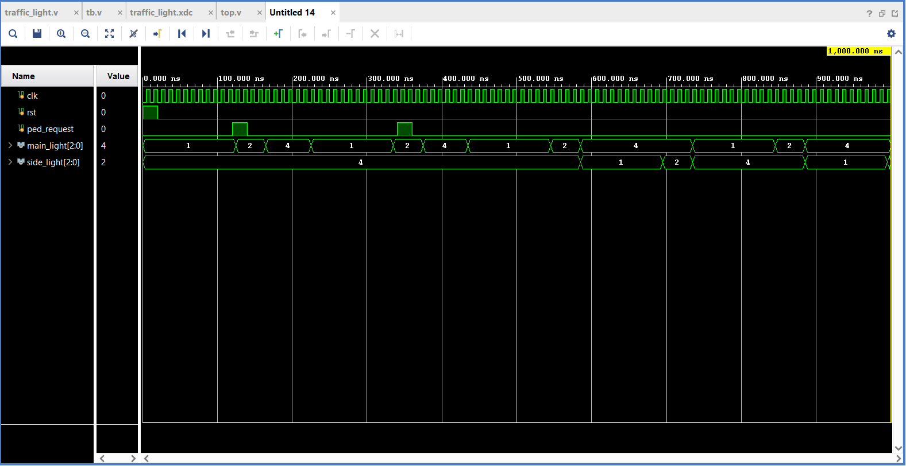

# 🚦 Traffic Light Controller using Verilog (FPGA + FSM)

## 📌 Overview

This project implements a **Traffic Light Controller** using **Verilog HDL** based on a **Moore Finite State Machine (FSM)**.
It includes a **pedestrian crossing feature with safe transition handling** and is successfully verified through simulation and deployed on an FPGA.

---

## ⚙️ Features

* Moore FSM-based design
* 5 operational states:

  * **S0** → Main Road Green
  * **S1** → Main Road Yellow
  * **S2** → Side Road Green
  * **S3** → Side Road Yellow
  * **S4** → Pedestrian Crossing (All Red)
* Latched pedestrian request (`ped_pending`) to capture short button presses
* Safe state transitions (no abrupt switching)
* Parameterized clock divider:

  * Fast mode for simulation
  * Slow mode for real FPGA timing
* Clean modular design (`traffic_light` + `top`)

---

## 🧠 FSM Design

```
S0 → S1 → S2 → S3 → S0
        ↓
   (ped_request)
        ↓
       S4 → S0
```

* Transitions occur based on a **counter (timing control)**
* Pedestrian request is serviced only after **yellow phase (safe condition)**

---

## 🛠️ Tools Used

* Verilog HDL
* Xilinx Vivado
* XSim Simulator
* Spartan-7 FPGA

---

## 🔌 FPGA Implementation

### Inputs:

* `clk` → 100 MHz onboard clock
* `btn[0]` → Reset
* `btn[1]` → Pedestrian request

### Outputs:

* LEDs represent traffic signals:

| LED    | Function    |
| ------ | ----------- |
| LED[0] | Main Green  |
| LED[1] | Main Yellow |
| LED[2] | Main Red    |
| LED[3] | Side Green  |
| LED[4] | Side Yellow |
| LED[5] | Side Red    |

---

## 🧪 Simulation

* Verified using testbench (`tb.v`)
* Fast clock mode used for simulation
* Observed correct:

  * State transitions
  * Timing behavior
  * Pedestrian handling
## 📈 Simulation Waveform


The waveform shows correct FSM transitions and pedestrian handling logic.
---

## 📁 Project Structure

```
traffic-light-controller/
│
├── src/
│   ├── traffic_light.v
│   ├── top.v
│
├── sim/
│   ├── tb.v
│
├── constraints/
│   ├── traffic_light.xdc
```

---

## 🚀 Future Improvements

* 7-segment countdown timer
* Pedestrian WALK signal (RGB LED)
* Vehicle detection-based adaptive control

---
## 💡 Key Learnings
- Designed and verified a Moore FSM using Verilog  
- Implemented timing control using clock division  
- Integrated simulation and FPGA deployment workflows  
## 👨‍💻 Author

**Soumil Gaur**
B.E. Electronics Engineering (VLSI Design & Technology)
